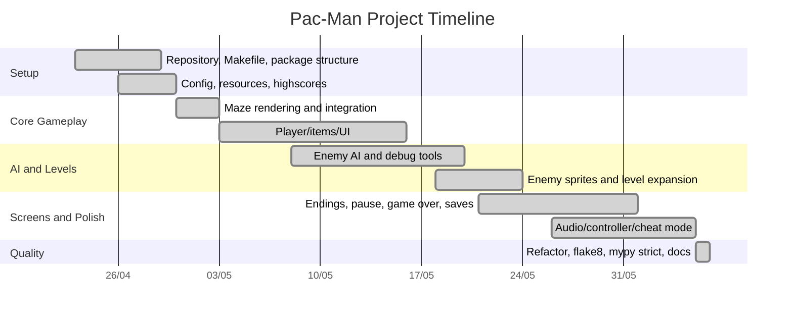

# Project Timeline

The project was tracked with Trello cards and validated against Git history. The Trello board shows planning/reference cards from 24/04 and a Done column containing the implemented feature set. Git provides the actual implementation chronology.

## Milestones

| Date | Milestone | Evidence |
| --- | --- | --- |
| 2026-04-23 | Project initialization | Repository, Makefile, basic package structure started. |
| 2026-04-29 | Core architecture | Package layout, resources, config, highscores, and first scene architecture. |
| 2026-05-03 | Gameplay loop integration | Music, UI, items, sprites, and level rendering connected. |
| 2026-05-15 | AI milestone | Four enemy AI behaviors and debug text visualizer introduced. |
| 2026-05-18 | Enemy/level expansion | Enemies implemented across levels with themed sprites. |
| 2026-05-20 | Debug instrumentation | Debug panel and visual tracer added for AI/pathfinding. |
| 2026-05-21 | Endings milestone | True ending, weird ending, win screen base, and enemy sprites added. |
| 2026-05-26 | Controller support | Xbox 360 controller and real-time plug/unplug handling. |
| 2026-06-01 | State reset cleanup | Menu/pause/game-over score and lives reset issues addressed. |
| 2026-06-05 | Quality and refactor | Level factorization, flake8 cleanup, cheat integration, and mypy strict. |
| 2026-06-06 | Final polish | Docstrings, music factorization, Easter eggs, artifact cleanup, and save bug fix. |
